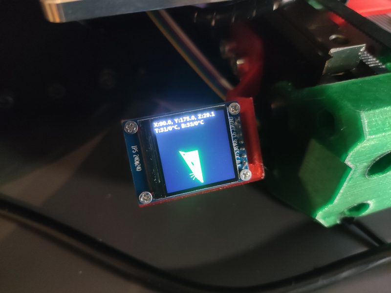
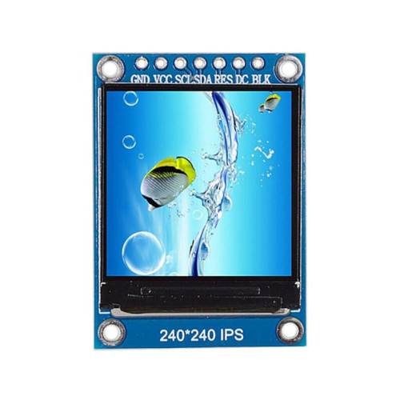
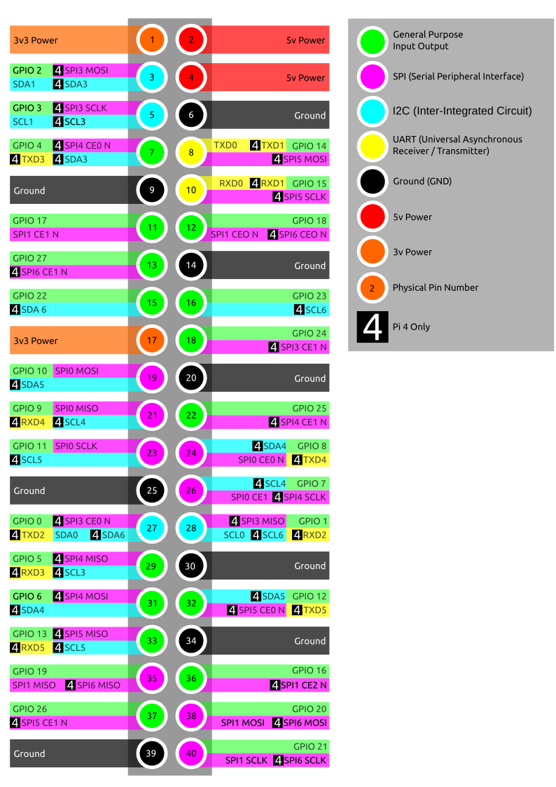

# Mini display for RatRig or Moonraker


Display show:
 - Position
 - Temperature
 - Ratrig LOGO (if no print)
 - Percentage and thumbnail (if print)
 
## Python
U must install  some dependencies 
```
sudo apt install python3-pil
```
## LCD
I use 240x240 IPS LCD 


## Raspi SPI
this is for raspi 4 but u can use other kind raspi  but u must use SPI0 only (i think)

At first u must enable SPI subsystem.
Edit /boot/config.txt
```
sudo nano /boot/config.txt
```
add 
```
dtparam=spi=on
```
reboot

You (for raspi4) can use for example SPI0 or SPI6 (SPI3 cant work as mode 3)
### SPI0
For SPI0 u must change port on line 25 in file status-lcd.py to 0  
connect LCD <---> Raspi
```
GND <---> GND
VCC <---> 3V3
SCL <---> GPIO11 (SPI0 SCLK)
SDA <---> GPIO10 (SPI0 MOSI)
RES <---> GPIO26
DC  <---> GPIO13
BLK <---> GPIO6
```
### SPI6
Edit /boot/config.txt adn add another line (previous line must keep)
```
sudo nano /boot/config.txt
```
add 
```
dtoverlay spi6-1cs
```
reboot  
connect LCD <---> Raspi
```
GND <---> GND
VCC <---> 3V3
SCL <---> GPIO21 (SPI6 SCLK)
SDA <---> GPIO20 (SPI6 MOSI)
RES <---> GPIO26
DC  <---> GPIO13
BLK <---> GPIO6
```  

For other pins (RES,DC,BLK) edit file status-lcd.py under line 25 (u will see)

## Install
copy folder status_lcd (with folder) to /home/pi
```
sudo cp service/status-lcd.service /lib/systemd/system/
chmod +x /home/pi/status_lcd/status-lcd.py
sudo systemctl daemon-reload
sudo systemctl enable status-lcd.service
sudo systemctl start status-lcd.service
```

## Holder
Print no support and then mount


